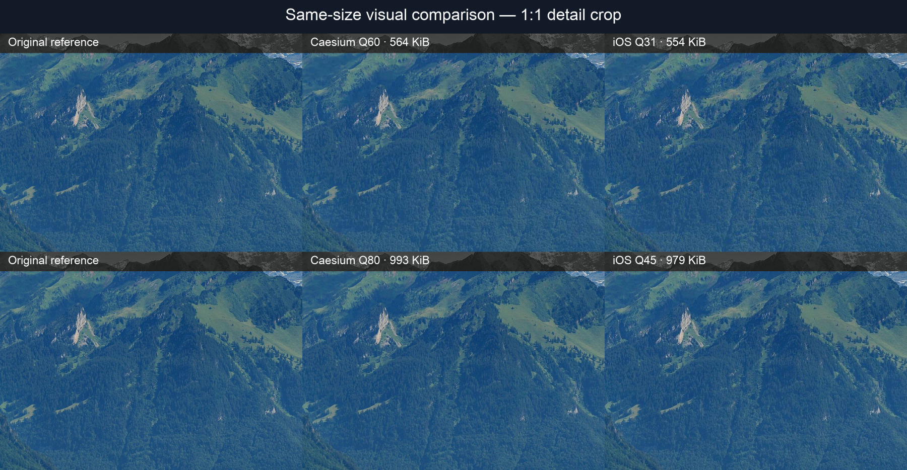
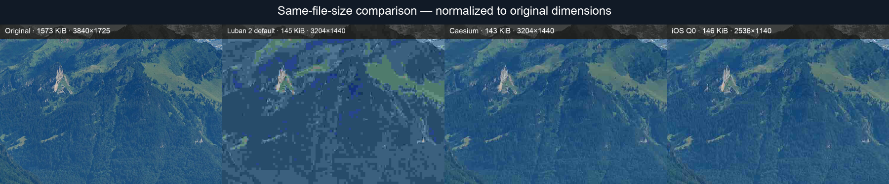
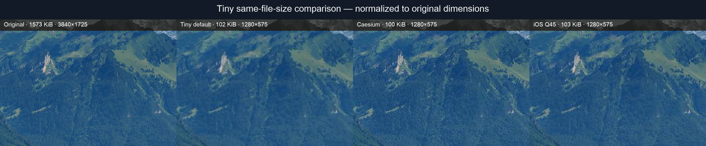

# flutter_caesium_ffi

[](https://pub.dev/packages/flutter_caesium_ffi)
[](https://pub.dev/packages/flutter_caesium_ffi/score)
[](https://github.com/zzzlazy/flutter_caesium_ffi/actions/workflows/ci.yml)
[](LICENSE)

Fast, high-quality, cross-platform image compression for Flutter. Compress,
resize, convert, or target a file size for JPEG, PNG, WebP, GIF, and TIFF using
one Dart API across Android, iOS, macOS, Windows, Linux, and web.

Native platforms use
[`libcaesium` 0.20.3](https://github.com/Lymphatus/libcaesium) through a stable
C ABI and Dart FFI. Browsers use
[`libcaesium-wasm` 0.5.0](https://github.com/zzzlazy/libcaesium-wasm).

The package supports JPEG, PNG, WebP, GIF, and TIFF on Android, iOS, macOS,
Windows, and Linux. Web supports in-memory JPEG, PNG, and WebP compression and
conversion.
Native libraries and web assets are bundled, so consuming applications do not
need Rust, Cargo, npm, a C compiler, or manual script tags.

## Features

- High-quality image compression powered by the Caesium/libcaesium codecs
- JPEG, PNG, WebP, GIF, and TIFF compression on native platforms
- Image resize and format conversion with metadata controls
- Best-effort target file size compression
- Memory and file path APIs running outside the Flutter UI isolate
- Bundled native binaries and WebAssembly: no consumer-side toolchain setup
- One plugin for Flutter mobile, desktop, and web

> **License notice:** this package and its bundled native code are licensed
> under AGPL-3.0-or-later. Applications that distribute or provide network
> access to a modified or combined work must satisfy the AGPL and all applicable
> third-party license obligations. Review [LICENSE](LICENSE) and
> [THIRD_PARTY_NOTICES.md](THIRD_PARTY_NOTICES.md) before shipping.

## Requirements

- Flutter 3.22 or newer
- Dart 3.4 or newer
- A browser with WebAssembly and JavaScript module support
- Android 5.0 / API 21 or newer
- iOS 12.0 or newer
- macOS 10.14 or newer
- Linux x86_64 with glibc 2.31 or newer
- Windows x64

## Installation

Install the published package:

```sh
flutter pub add flutter_caesium_ffi
```

Or add it manually:

```yaml
dependencies:
  flutter_caesium_ffi: ^1.0.1
```

To track unreleased changes from the default branch instead:

```yaml
dependencies:
  flutter_caesium_ffi:
    git:
      url: https://github.com/zzzlazy/flutter_caesium_ffi.git
      ref: main
```

Then run `flutter pub get` and build the application normally. Native binaries
and the WebAssembly module are already bundled. Rust is only needed when
modifying or rebuilding the wrappers.

## Usage

The memory API works on native platforms and web:

```dart
import 'package:flutter_caesium_ffi/flutter_caesium_ffi.dart';

final result = await FlutterCaesiumFfi.compress(
  encodedImageBytes,
  options: const CaesiumOptions(
    keepMetadata: false,
    jpeg: JpegOptions(quality: 75, progressive: true),
    resize: ResizeOptions(width: 1600),
  ),
);

print('${result.inputSize} -> ${result.outputSize} bytes');
print('native: ${FlutterCaesiumFfi.nativeVersion}');
```

The public operations are `compress`, `compressFile`, `compressToSize`,
`compressFileToSize`, `convert`, `convertFile`, and `nativeVersion`.

Native image work runs on a background isolate. On web, the WASM module is
loaded lazily on the first call and currently runs on the browser main thread.

## Platform API support

| Operation | Native | Web |
| --- | --- | --- |
| `compress` | JPEG, PNG, WebP, GIF, TIFF | JPEG, PNG, WebP |
| `compressToSize` | Yes | Yes |
| `convert` | Yes | JPEG, PNG, WebP output |
| File path APIs | Yes | Not available in browsers |

On web, `jpeg.preserveIcc` is not available in the older libcaesium version used
by the WASM build. Web resize dimensions are limited to 999999.

## Options and behavior

`CaesiumOptions` exposes JPEG, PNG, WebP, GIF, TIFF, resize, and metadata
settings. Defaults match `libcaesium`: quality 80, metadata removed, progressive
JPEG enabled, and PNG optimization level 3.

File operations never overwrite an existing output. Empty input, invalid
quality or dimensions, missing input files, missing output directories, and
equal input/output paths fail before encoding starts. Native failures are
reported as `CaesiumException(code, message)`.

Target-size compression is best effort because some inputs or formats cannot
reach every requested size. Set `returnSmallest: true` to return the smallest
candidate when the exact target cannot be reached.

## Bundled platforms

| Platform | Bundled architecture |
| --- | --- |
| Android | `arm64-v8a`, `armeabi-v7a`, `x86_64` |
| iOS | arm64 device; arm64/x86_64 simulator |
| macOS | arm64/x86_64 universal |
| Windows | x64 MSVC |
| Linux | x86_64, glibc 2.31+ |
| Web | WebAssembly, JPEG/PNG/WebP |

## JPEG compression benchmark

The following results use one already-compressed 3840 × 1725 JPEG landscape
photo. Outputs were matched as closely as practical by file size and, except
where noted, by dimensions. SSIM was calculated after decoding and restoring
resized outputs to the source dimensions, so resize loss is included. Higher is
better.

| Comparison | Output dimensions | Approx. size | Caesium SSIM | Other SSIM | Result |
| --- | ---: | ---: | ---: | ---: | --- |
| iOS `UIImage.jpegData` | 3840 × 1725 | 0.55 MiB | **0.9243** | 0.9082 | Caesium better |
| iOS `UIImage.jpegData` | 3840 × 1725 | 0.97 MiB | **0.9639** | 0.9493 | Caesium better |
| iOS `UIImage.jpegData` | 3840 × 1725 | 1.46 MiB | 0.9944 | 0.9941 | Essentially tied |
| [TinyImage](https://tinypng.com/) (closed-source) | 3840 × 1725 | 0.66 MiB | **0.9372** | 0.9314 | Caesium slightly better |
| [Luban 2.0.1](https://github.com/Curzibn/Luban) default | 3204 × 1440 | 0.14 MiB | **0.8055** | 0.6926 | Caesium better |
| [Tiny 1.1.0](https://github.com/Sunzxyong/Tiny) default | 1280 × 575 | 0.10 MiB | **0.7763** | 0.7541 | Caesium better |

### Visual comparisons

The crops below are shown at equal or near-equal file sizes. The Luban and Tiny
outputs are normalized to the source dimensions so their resize loss remains
visible.

#### Caesium vs iOS

The top row compares approximately 0.55 MiB outputs; the bottom row compares
approximately 0.97 MiB outputs.



#### TinyImage vs Caesium vs iOS

Left to right: original, [TinyImage](https://tinypng.com/) at 671 KiB, Caesium
at 660 KiB, and iOS at 667 KiB.


#### Luban vs Caesium vs iOS



#### Tiny vs Caesium vs iOS



For the TinyImage comparison, SSIMULACRA2 was 62.01 for Caesium and 61.32 for
TinyImage. The Luban and Tiny rows compare their default strategy with Caesium
target-size output at the same dimensions. Luban chose JPEG Q5 for this
panoramic image, while Tiny resized the long edge to 1280 pixels.

These are single-image results, not a claim that one encoder wins for every
photo. The source was the 3840-pixel version of
[Fronalpstock big.jpg](https://commons.wikimedia.org/wiki/File:Fronalpstock_big.jpg);
Caesium was tested with `caesiumclt` 1.4.0, iOS with
`UIImage.jpegData(compressionQuality:)` on an iOS 26 Simulator, and quality
with FFmpeg SSIM/PSNR plus SSIMULACRA2 where available. Human evaluation and a
larger corpus should be used for production codec decisions.

## Building native libraries

End users do not need these steps. Contributors need Rust 1.92.0 plus the
platform SDK:

```sh
dart run tool/build_native.dart --platform macos
dart run tool/build_native.dart --platform ios
dart run tool/build_native.dart --platform android
dart run tool/build_native.dart --platform linux
dart run tool/build_native.dart --platform windows
```

Android builds also require `cargo-ndk`. Regenerate private Dart bindings after
changing the C header:

```sh
dart run ffigen --config ffigen.yaml
```

Release Linux binaries use Zig to pin the glibc baseline:

```sh
FLUTTER_CAESIUM_LINUX_GLIBC=2.31 \
  dart run tool/build_native.dart --platform linux
```

The regular GitHub Actions workflow runs Dart formatting, analysis, tests, and
bundled-binary checksum verification for every push and pull request. The
separate native workflow only runs when Rust, C ABI, bindings, native packaging,
or prebuilt-binary files change. Version tags and manual dispatches always run
the complete native workflow.

The native workflow builds and strips each platform binary, verifies example
application linking from the checked-in binaries before rebuilding them,
combines a complete package artifact, and runs `dart pub publish --dry-run`.
It does not publish to pub.dev. Checksums for the checked-in binaries are in
[`NATIVE_CHECKSUMS.sha256`](NATIVE_CHECKSUMS.sha256).

## Development

```sh
flutter pub get
flutter analyze
flutter test
flutter build web --release
cargo +1.92.0 test --manifest-path rust/Cargo.toml
```

To run native integration tests against a local library:

```sh
FLUTTER_CAESIUM_FFI_LIBRARY=/absolute/path/to/libflutter_caesium_ffi.dylib \
  flutter test test/native_integration_test.dart
```

See the runnable app in [`example`](example).
